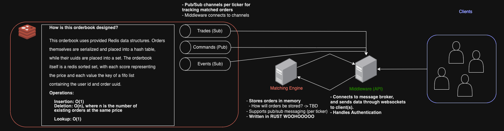

# smol exchange
a smol exchange


Overview:
```
├── apps
│   └── matching-engine
│       ├── Cargo.lock
│       ├── Cargo.toml
│       └── src
│           ├── engine
│           │   ├── engine.rs
│           │   ├── mod.rs
│           │   └── orderbook.rs
│           ├── errors
│           │   ├── errors.rs
│           │   └── mod.rs
│           ├── lib.rs
│           └── main.rs
├── assets
│   └── diagram.png
├── devcontainer.json
├── docker-compose.yml
├── dockerfiles
│   └── Dockerfile_redis
├── exchange.code-workspace
└── redis
    ├── data
    ├── entrypoint.sh
    └── redis-stack.conf
```