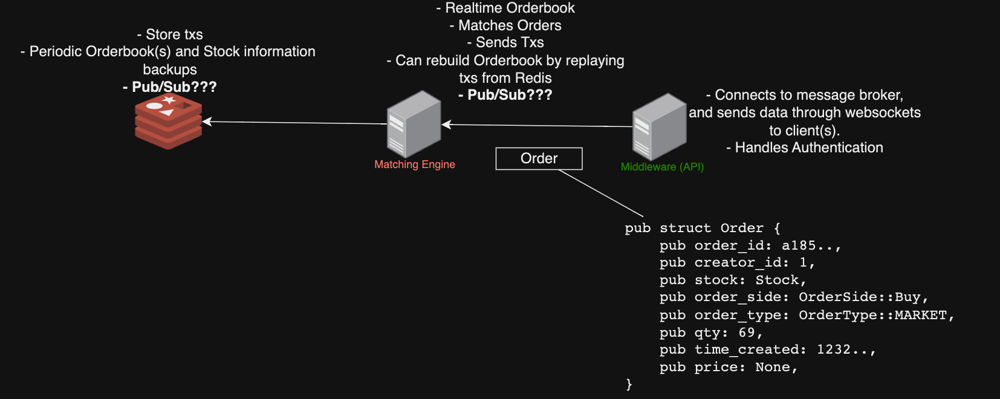

# smol exchange
a smol exchange


## TODO
- [x] Redis
- [x] Docker
- [x] Orderbook
- [ ] Matching Engine
- [ ] Tests
- [ ] CI/CD
- [ ] API
    - [ ] Websocket
    - [ ] REST API
- [ ] Demo Frontend
- [ ] Documentation

## Getting Started

### Prerequisites
- [Docker](https://docs.docker.com/get-docker/)
- [Docker Compose](https://docs.docker.com/compose/install/)
- [Rust](https://www.rust-lang.org/tools/install)

### Running the Matchine Engine
1. Clone the repository
2. `cd apps/matching-engine`
3. Run `docker compose up`
4. Run `cargo test --verbose -- --nocapture`


Directory Structure: 
```
├── apps
│   └── matching-engine
│       ├── Cargo.lock
│       ├── Cargo.toml
│       └── src
│           ├── engine
│           │   ├── engine.rs
│           │   ├── mod.rs
│           │   └── orderbook.rs
│           ├── errors
│           │   ├── errors.rs
│           │   └── mod.rs
│           ├── lib.rs
│           └── main.rs
├── assets
│   └── diagram.png
├── devcontainer.json
├── docker-compose.yml
├── dockerfiles
│   └── Dockerfile_redis
├── exchange.code-workspace
└── redis
    ├── data
    ├── entrypoint.sh
    └── redis-stack.conf
```